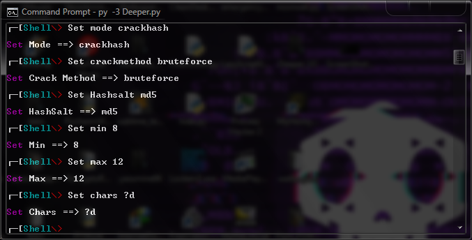
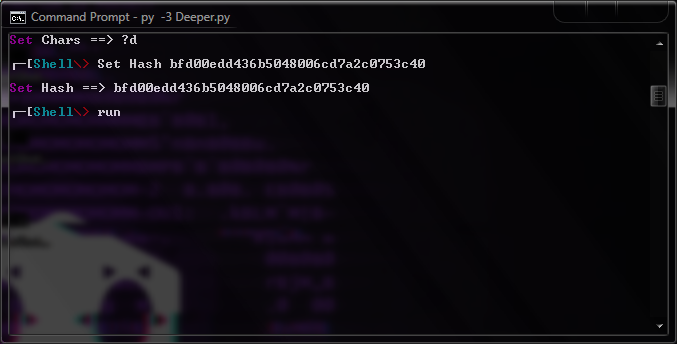
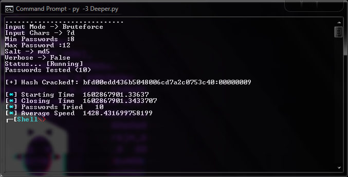
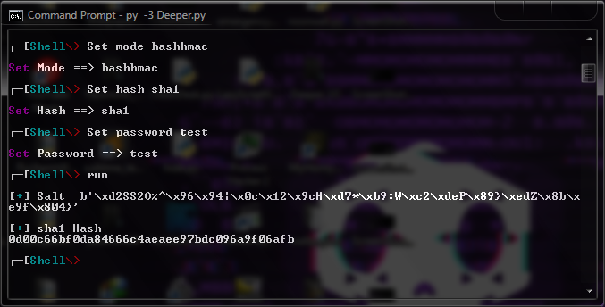

# deeper

pip3 install -r requirements.txt

Deeper CR With Style 

Encrypting Files With Aes and Rsa Public And Private Keys 

Encrypt file or files in folder or subfolders or Partition

Deeper Cr Shell Mode:

Modes In Shell :

Hashing ,Encrypt ,hashing with hmac ,crack hash dictionary and bruteforce attack

Auto Replace Spaces And Chars Like & () In Files 

System
Linux Windows 

     

